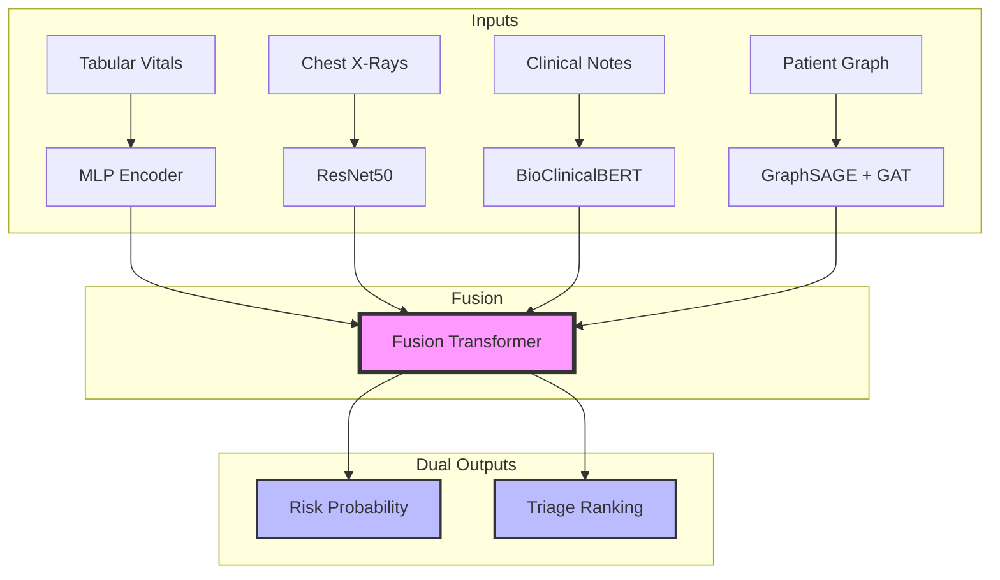

<div align="center">

# 🏥 MED-RiskNET
### Multimodal Medical Risk Prediction Network

**A state-of-the-art deep learning system that integrates Clinical Records, Medical Imaging, Doctor's Notes, and Patient Similarity Graphs.**

[](https://python.org)
[](https://pytorch.org)
[](https://huggingface.co)
[](https://pytorch-geometric.readthedocs.io)
[](https://fastapi.tiangolo.com)
[](https://www.docker.com)
[](LICENSE)

[View Architecture](#-architecture) • [Key Features](#-key-features) • [Quick Start](#-quick-start) • [Inference Demo](#-inference-demo)

</div>

---

## 🏗️ **Architecture**

MED-RiskNET uses a **Late-Fusion Architecture** to process four distinct data modalities simultaneously.



---

## 📊 **Key Features**

| Feature | Description | Tech Stack |
| :--- | :--- | :--- |
| **Multimodal Integration** | Fuses Vitals, X-Rays, Text, and Graph structure. | `TorchFusion`, `Transformer` |
| **Dual-Task Learning** | Predicts absolute **Risk** and relative **Triage Rank** simultaneously. | `BCE Loss` + `Pairwise Hinge Loss` |
| **Uncertainty Quantification** | Knows when it doesn't know. Outputs confidence scores. | `MC-Dropout` |
| **Full Explainability** | Tells you *why*: Feature importance, Image Heatmaps, Graph Neighbors. | `SHAP`, `Grad-CAM`, `GNNExplainer` |
| **Production Ready** | REST API with documentation and Docker support. | `FastAPI`, `Docker` |

---

## 🚀 **Quick Start**

### 1. Installation

```bash
# Clone the repository
git clone https://github.com/OnlyAhad13/MED-RiskNet.git
cd MED-RiskNet

# Create environment
conda create -n medrisknet python=3.11
conda activate medrisknet

# Install dependencies
pip install -r requirements.txt
```

### 2. Run Inference (New!)

We provide a CLI tool to run the model on a single simulated patient instantly.

```bash
python scripts/infer.py
```

**Sample Output:**
```json
{
  "risk_probability": 0.4921,
  "risk_category": "Medium",
  "triage_score": -0.0812,
  "uncertainty_score": 0.0281,
  "input_features": {
    "age": 65,
    "bp": "140/90",
    "text": "Patient has history of hypertension."
  }
}
```

### 3. Training & Evaluation

<details>
<summary><b>Click to expand Training commands</b></summary>

```bash
# Run a quick smoke test
python tests/test_train_smoke.py

# Full Evaluation
python evaluation/evaluate.py --checkpoint test_checkpoints/best_model.pt
```
</details>

---

## 🌐 **API Deployment**

Get a production-ready REST API up and running in seconds.

```bash
# Start the server locally
bash scripts/serve.sh
```

**Docs are available at:** `http://localhost:8000/docs`

---

## 🔍 **Explainability Gallery**

| SHAP (Tabular) | Grad-CAM (Image) |
| :---: | :---: |
| *Identifies key physiological factors* | *Highlights suspicious regions in X-Ray* |
| `explainability/shap_explainer.py` | `explainability/gradcam.py` |

---

## 📚 **Citations**

If you use **MED-RiskNET**, please cite:

```bibtex
@article{medrisknet2025,
  title={MED-RiskNET: Multimodal Medical Risk Prediction with Explainability},
  author={Syed Abdul Ahad},
  year={2025}
}
```

<div align="center">

**[🐛 Report Bug](https://github.com/OnlyAhad13/MED-RiskNet/issues) • [📝 Request Feature](https://github.com/OnlyAhad13/MED-RiskNet/issues)**

Made with ❤️ by [OnlyAhad13](https://github.com/OnlyAhad13)

</div>
