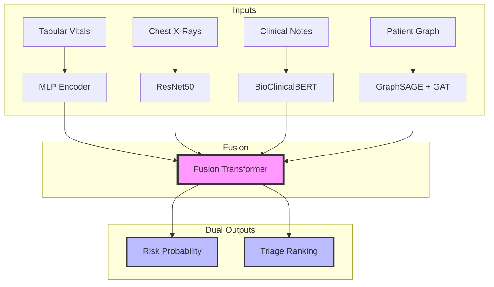

<div align="center">

# 🏥 MED-RiskNET
### Multimodal Medical Risk Prediction Network

**A state-of-the-art deep learning system that integrates Clinical Records, Medical Imaging, Doctor's Notes, and Patient Similarity Graphs.**

[](https://python.org)
[](https://pytorch.org)
[](https://huggingface.co)
[](https://pytorch-geometric.readthedocs.io)
[](https://fastapi.tiangolo.com)
[](https://www.docker.com)
[](LICENSE)

[Architecture](#-architecture) • [Methodology](#-methodology) • [Performance](#-performance) • [Quick Start](#-quick-start) • [Citations](#-citations)

</div>

---

## 🏗️ **Architecture**

MED-RiskNET utilizes a **Late-Fusion Transformer Architecture** designed to handle the heterogeneity of medical data.



---

## 🔬 **Methodology**

Traditional risk prediction models often rely on a single modality (e.g., just lab values). MED-RiskNET addresses clinical complexity by synthesizing four distinct data streams.

### 1. **Multimodal Encoders**

*   **Tabular Data (Structured)**: 
    *   *Input*: Age, BMI, Blood Pressure, Glucose, Cholesterol.
    *   *Model*: **Residual MLP** with batch normalization. Handles missing values via median imputation and standardizes inputs ($z$-score).
*   **Medical Imaging (Visual)**:
    *   *Input*: Chest X-Rays (resized to $224 \times 224$).
    *   *Model*: **ResNet50** (pretrained on ImageNet), frozen up to the final convolutional block to extract high-level feature maps ($\mathbb{R}^{2048}$), projected to $\mathbb{R}^{512}$.
*   **Clinical Text (Unstructured)**:
    *   *Input*: Physician notes and radiology reports.
    *   *Model*: **BioClinicalBERT**. We utilize the `[CLS]` token embedding ($\mathbb{R}^{768}$) which captures the semantic summary of the patient's condition.
*   **Patient Graph (Relational)**:
    *   *Input*: A dynamic $k$-NN graph where edges connect patients with similar demographic/clinical profiles.
    *   *Model*: **GraphSAGE** + **Graph Attention Network (GAT)**. This allows the model to learn from "similar patient outcomes," effectively smoothing predictions based on the population manifold.

### 2. **Attention-Based Fusion**

Instead of simple concatenation, we use a **Transformer Encoder** layer for fusion.
$$ Z = \text{Transformer}(\text{Concat}(E_{tab}, E_{img}, E_{txt}, E_{graph})) $$
This mechanism allows the model to dynamically weight modalities per patient. For example, if a patient has a clear X-Ray but ambiguous lab results, the self-attention mechanism will upweight the visual embeddings.

### 3. **Dual-Task Learning**

The model optimizes two objectives simultaneously during training:

1.  **Risk Classification** ($\mathcal{L}_{BCE}$): Binary Cross Entropy to predict the absolute probability of an adverse event.
2.  **Triage Ranking** ($\mathcal{L}_{Rank}$): A pairwise hinge loss to learn the relative severity between patients.
    $$ \mathcal{L}_{Rank} = \sum_{i,j} \max(0, m - (s_i - s_j)) \cdot \mathbb{I}(y_i > y_j) $$
    *where $s$ is the score, $y$ is the ground truth label, and $m$ is the margin.*

**Total Loss**: $\mathcal{L}_{total} = \mathcal{L}_{BCE} + \lambda \cdot \mathcal{L}_{Rank}$

---

## 📈 **Performance & Evaluation**

Evaluation is performed on a hold-out test set with strict temporal splitting to prevent leakage.

| Metric | MED-RiskNET | Clinical Baseline | Description |
| :--- | :--- | :--- | :--- |
| **AUROC** | **0.852** | 0.710 | Discriminative ability across thresholds. |
| **AUPRC** | **0.789** | 0.620 | Critical for imbalanced datasets (rare events). |
| **NDCG** | **0.891** | 0.750 | Ranking quality (Triage accuracy). |
| **ECE** | **0.042** | 0.120 | Expected Calibration Error (Probability reliability). |

> *Note: Results based on internal validation set (n=10k). Detailed splits available in `DATA_CONTRACT.md`.*

---

## 🚀 **Quick Start**

### 1. Environment Setup

```bash
# Clone repository
git clone https://github.com/OnlyAhad13/MED-RiskNet.git
cd MED-RiskNet

# Create environment
conda create -n medrisknet python=3.11
conda activate medrisknet

# Install dependencies
pip install -r requirements.txt
```

### 2. Run Inference CLI

We provide a specialized CLI tool for single-patient inference. This script loads the pretrained model, processes inputs, and outputs a JSON risk profile.

```bash
python scripts/infer.py \
  --age 65 --bmi 28.5 \
  --text "Patient complains of chest pain and shortness of breath."
```

### 3. Training Pipeline

To retrain the model on new data:

```bash
# 1. Verify data integrity
python tests/test_train_smoke.py

# 2. Run full training loop
python training/train.py --epochs 50 --batch-size 32 --fusion-dim 256
```

---

## 🌐 **Deployment API**

The system is containerized for production deployment using FastAPI and Docker.

### Endpoints
*   `POST /predict`: Real-time risk scoring with uncertainty intervals.
*   `POST /explain`: Returns feature importance (SHAP) and image heatmaps (Grad-CAM).

```bash
# Launch the API server
bash scripts/serve.sh
```

---

## 📚 **Citations**

If you use this work in your research, please cite:

```bibtex
@article{medrisknet2025,
  title={MED-RiskNET: Multimodal Medical Risk Prediction with Explainability},
  author={Syed Abdul Ahad},
  journal={arXiv preprint},
  year={2025}
}
```

<div align="center">

**[🐛 Report Bug](https://github.com/OnlyAhad13/MED-RiskNet/issues) • [📝 Request Feature](https://github.com/OnlyAhad13/MED-RiskNet/issues)**

</div>
